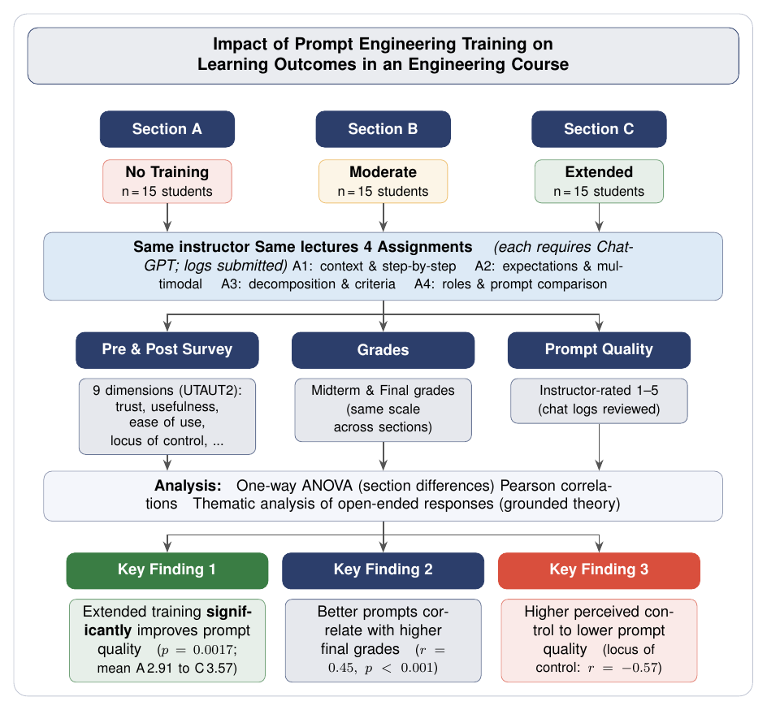

# GenAI Literacy Trial



Privacy-preserving reproducibility artifact for a three-arm prompt-engineering training trial in an engineering algorithms course.

The repository contains the public analysis package, synthetic fixtures, aggregate-only manuscript outputs, validation checks, and automated privacy gates. It is designed for conference review and reuse without exposing participant-level data.

## Repository Contents

- `src/genai_literacy_trial/`: reusable Python package for aggregate generation, validation, and privacy auditing
- `tests/`: unit and CLI tests using synthetic fixtures only
- `data/synthetic/`: non-identifying fixtures for exercising the public pipeline
- `paper_outputs/`: aggregate-only tables and manuscript validation report
- `.github/workflows/ci.yml`: test and privacy-audit workflow
- `Dockerfile`: containerized test entry point

## Privacy Policy

Participant-level research records are not distributed. The public repository must not contain names, email addresses, institutional identifiers, individual grades, individual survey rows, raw prompt transcripts, exported submissions, notebooks, source spreadsheets, or private draft documents.

Every public release should pass the privacy gate:

```bash
uv run genai-literacy-trial audit-privacy
```

Maintainers may use an ignored `privacy_patterns.local.yml` file for project-specific private patterns during release review. That file is intentionally excluded from version control.

## Setup

```bash
uv sync
```

## Reproduce Aggregate Outputs

The default command runs on synthetic fixtures and regenerates the public aggregate tables and validation report:

```bash
uv run genai-literacy-trial reproduce-paper
```

Outputs are written to `paper_outputs/`. The validation report compares reproducible aggregate statistics against the manuscript targets; mismatches are surfaced for author review rather than silently changing the manuscript narrative.

## Test

```bash
uv run pytest
uv run genai-literacy-trial audit-privacy
```

## Release Checklist

Before publishing a release:

1. Run `git status --short` and confirm only intended public files are staged.
2. Run `git ls-files` and confirm no participant-level records, notebooks, spreadsheets, exported submissions, or private documents are tracked.
3. Run `uv run pytest`.
4. Run `uv run genai-literacy-trial audit-privacy`.
5. Inspect `paper_outputs/validation_report.csv`; all manuscript validation targets should be marked `ok` or explicitly documented before release.
