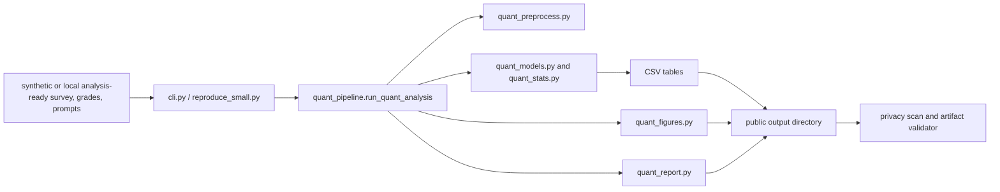

# Architecture

## System boundary

The primary path starts at the Typer CLI or its script wrappers and ends with aggregate-only public artifacts. The package does not fetch external data or train a machine-learning model.

## Package responsibilities

| Path | Responsibility |
| --- | --- |
| `cli.py` | Typer commands for quantitative analysis, legacy aggregates, validation, hygiene, and privacy. |
| `quant_pipeline.py` | Reads configured inputs, validates them, orchestrates preprocessing/models, writes public artifacts, and scans the public output. |
| `quant_preprocess.py` | Retains paired survey participants, maps configured values, builds participant and assignment tables, validates inventory, and suppresses small cells. |
| `quant_models.py` | Fits prompt trajectory, participant-effect, learning-outcome, calibration, survey-change, and missingness-sensitivity analyses. |
| `quant_stats.py` | Bootstrap intervals, correlations, effect sizes, hypothesis tests, FDR adjustment, reliability, and sensitivity calculations. |
| `quant_figures.py` | Writes the three quantitative figure stems in PNG and PDF formats. |
| `quant_report.py` | Builds `quantitative_report.md` from aggregate tables. |
| `quant_schema.py` | Names public tables, output keys, normalized labels, and typed result contracts. |
| `privacy.py` | Scans selected public trees for private-data patterns and denied suffixes. |
| `validate_artifacts.py` | Checks the small-run source/output contract and mtime freshness. |
| `analysis.py` | Implements the retained legacy aggregate-paper workflow. |

## Public contracts

The names in `quant_schema.py`, `quant_figures.py`, and `quant_report.py` are consumed by generation, validation, tests, and documentation. Change them only with a coordinated contract update. `paper_outputs/` is checked-in aggregate output; `repro_outputs/` is ignored local output.

## Legacy boundary

The legacy commands call `analysis.py` directly and use the older source column names such as `Email`, `Group`, `Midterm Grade`, and `Final Grade`. The newer quantitative path uses the configurable schema in `quant_config.py`. These paths share dependencies but not the same table contract.
