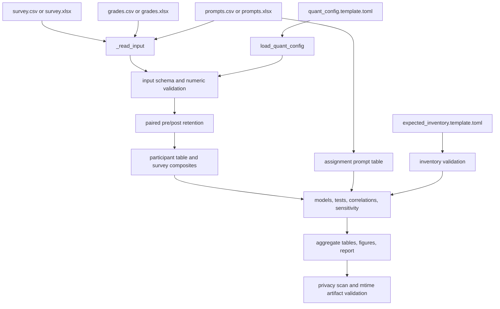

# Data Flow

## Quantitative path

## Inputs and retention

The configured minimum input columns are:

- survey: participant ID and phase;
- grades: participant ID, group, midterm grade, and final grade;
- prompts: participant ID, assignment, and prompt score.

The remaining configured columns drive optional covariates and survey composites. The preprocessing path keeps participants with the required paired survey observations, maps configured labels and numeric values, joins grades and prompt summaries by the configured participant key, and validates group, assignment, score, duplicate-row, and expected-inventory contracts.

Prompt assignments remain at assignment level for trajectory and missingness analyses. Participant-level analyses use one row per participant. This distinction prevents prompt rows from inflating participant-level sample sizes.

## Analysis products

`run_quant_analysis()` produces the table contract in `quant_schema.REQUIRED_QUANT_TABLES`, then writes:

1. 19 aggregate CSV tables;
2. three figures, each as PNG and PDF;
3. one generated quantitative Markdown report;
4. a privacy scan of the selected public output directory.

The report is generated from the tables rather than from private source rows.

## Legacy data flow

`reproduce-paper` loads the three CSV files through `analysis.load_csv_inputs()`, computes prompt means and grade correlations, writes five aggregate CSVs, and validates manuscript target metrics. It is a compatibility path with a separate, older schema and output contract.

## Output cleanup

Before writing the quantitative public directory, the pipeline removes only existing top-level files with generated suffixes `.csv`, `.pdf`, `.png`, and `.md`. It does not remove nested files or unrelated suffixes. Use a fresh ignored directory when the output contents need to be unambiguous.
