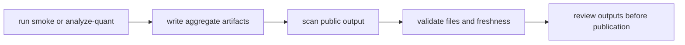
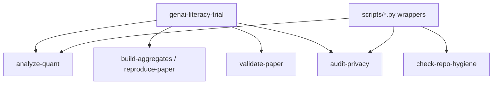
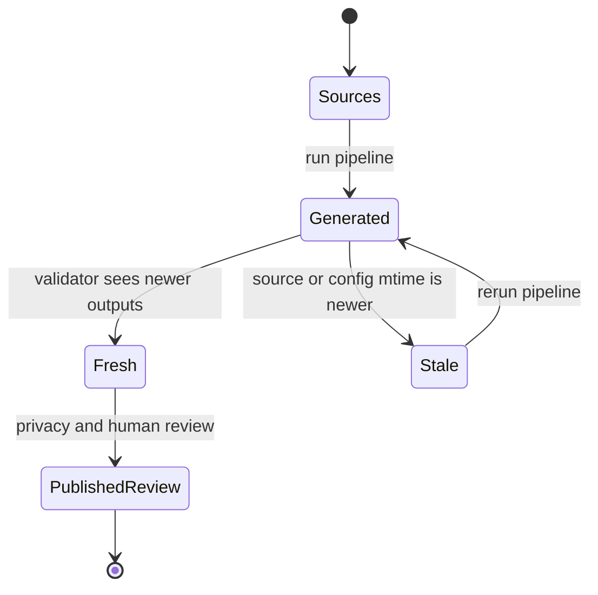

# Diagrams

These diagrams show the current implemented paths. They omit individual model formulas, every table column, and private author-side cleaning steps so the main control flow remains readable.

## Workflow and checks

## CLI map

## Artifact lifecycle

