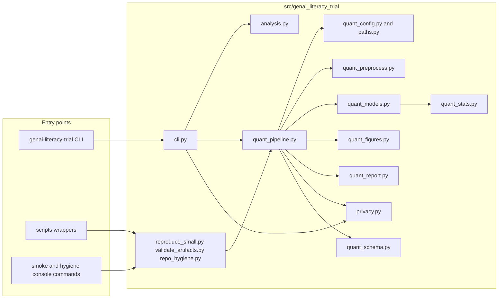
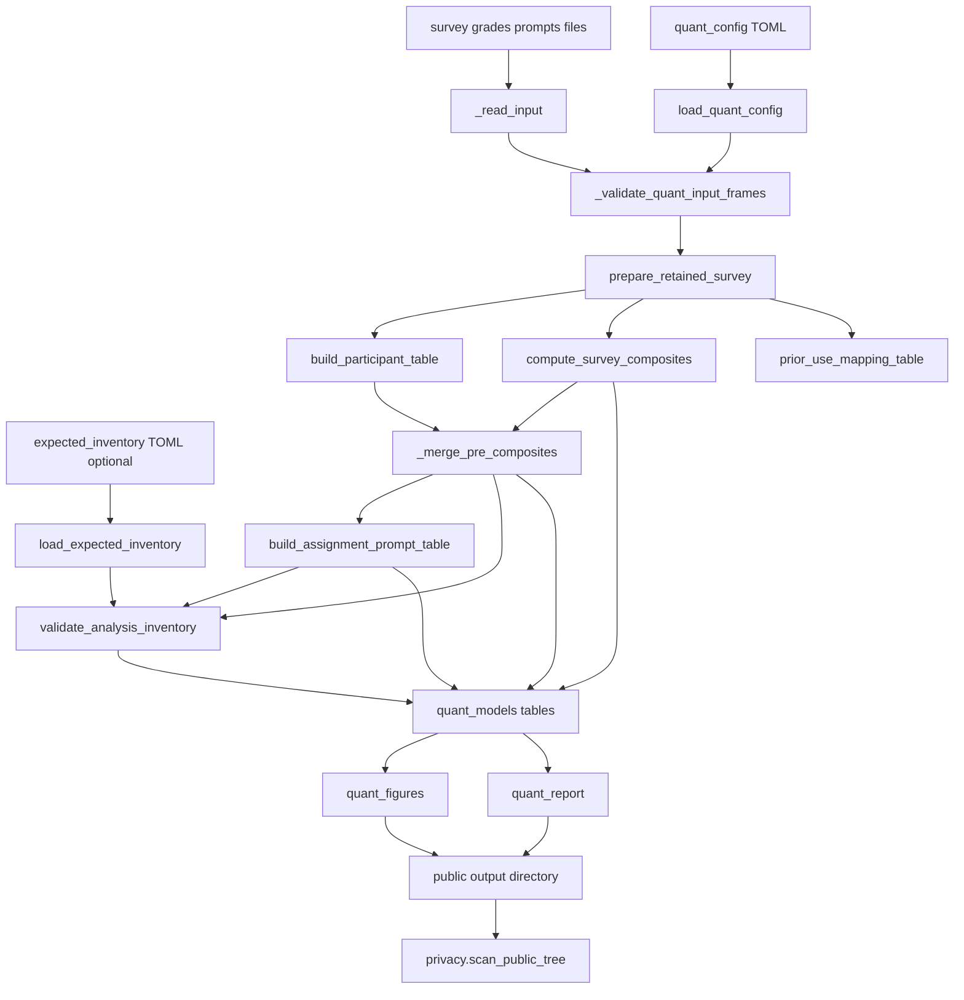
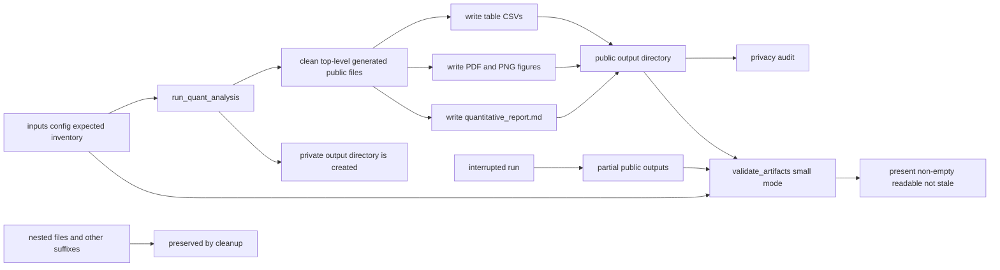
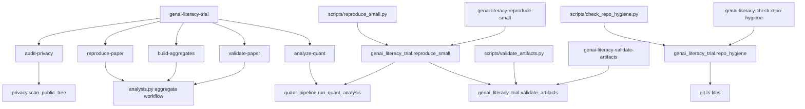
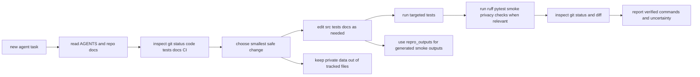

# Repository Diagrams

These Mermaid diagrams summarize the current repository structure and workflow. They intentionally omit most test files, individual table names, and model formulas so the diagrams stay maintainable; those details are documented in `docs/artifacts.md`, `docs/data_flow.md`, and `docs/repo_map.md`.

## High-Level Architecture

## Quantitative Data Flow

This is the main `run_quant_analysis()` path used by `genai-literacy-trial analyze-quant` and the small reproducibility runner.

## Artifact Lifecycle

The public smoke workflow writes to ignored `repro_outputs/small/`. Full/private runs may target `paper_outputs/quantitative/` or private ignored directories depending on CLI options.

## CLI And Module Map

## Agent Workflow

This reflects the repository guidance in `AGENTS.md` and `docs/agent_playbook.md`.

